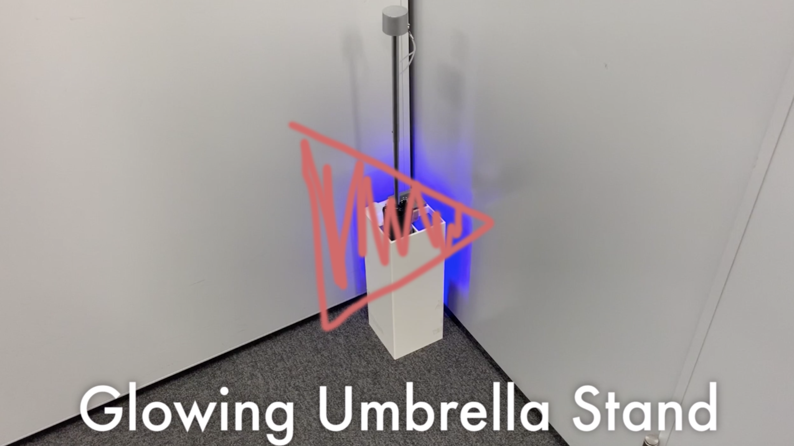

# GUS (Glowing Umbrella Stand)

## 製品概要
### 傘立て × Tech

雨の日に光るスマート傘立て。
出かける前に天気予報を確認する手間を省け、傘の持ち出し忘れを防げる。

### 背景

- 今年の夏雨が多かった
	- 朝は晴れていても突然降り出すこともあった
	- 傘は荷物になるため必要なときだけ持ち出したい
	- 天気予報を見るのが面倒かった、楽にしたい
		- 天気予報の確認には体力が必要
    	- 天気を確認するために毎日15秒を死ぬまで使い続けるとすると、$15 \times 365 \times 80$ となる。

- 日本の傘消費量は多い
	- 傘忘れて何回も買う人がいる
    	- 洋傘の国内年間消費量は推計で1億3千万本程度
    	- 一本70cmとして国内年間消費量を繋げると地球を4.2周できる
    - 平均すると外に出る人は毎年2本ぐらい買うと思われる
    - 僕は７本持っている

## 製品説明

### 特長

以下に本プロダクトの特徴を示す。

#### 1. 一目でわかる

傘を持つべきなのか、一目でわかる (側面LED)

- 天気に合わせて傘立ての色(雨なら青、晴れなら赤)が変わる。
- これにより、何も考えなくても、傘の必要性がわかる。

#### 2. 周囲と連携できる

近くにある傘立てと連携できる (上面LED)

- 周囲の傘持ち出し状況が確認可能
- 周りに合わせて傘を持っていくかを判断できる

近くの傘立てと連携して天気予測の精度をあげることできる
近所の人々がみんな傘を持ち出した場合、自分も持ち出す必要があるとわかる

#### 3. インテリア性

**ミニマル**なデザインの傘立てが、**スマート**かつ**エレガント**に光る。

- それは田舎者を脅かすには十分すぎる
- 人が来た時に瞬時に反応し、省エネで、環境を配慮する機能性もある

### 解決出来ること

- 傘の持ち出し忘れを防ぐことができる
- 傘を持っていくか否かに迷う時間を節約できる
- 無駄傘の購入やゴミになることを防げる
- 無駄傘を生産する必要がなくなり、環境に対する負担が減る

### 今後の展望

もっと機能を多く
- 玄関前にあることが想定されるため、監視カメラ、鍵代わりになることもできる
もっと美しく、強く
- 今回市場にあるものをかき集めて作っているので、無理な設計がある。なので、もっと最適な設計で作り直す価値はある
集めたデータを利用して傘業界に良い意味をもたらす
- 傘の使用率や傘利用者の利用シーンなどのデータで、傘業界がもっと人々が求める傘を作ることも可能になる

## 開発内容・開発技術

このハッカソンにおいて、行った作業ついて述べる

### コンセプト

- 製品を実現するための必要機能を議論し、決定した
- 必要機能を技術的に実現するための手法、設計について議論し、決定した

### 設計

- インテリアとしても使えるデザイン性
- 人間が近づいた時だけ反応し、省エネを図る機能性

### テスト

- リレードライブ
- 回路動作テスト
- センサー動作テスト
- サーバー動作テスト
- 物理的負荷テスト

### 買い出し

- 徒歩で秋葉原の秋月電子に物資調達
- ブレードボードやスイッチなどの必要品を購入した

### 実装
- ハード班
    - 回路作成
    - 物資調達
    - 組み立て
- ソフト班
    - 環境構築
    - サーバー実装

<!--
### ２日のご飯事情

- １日目
    - 朝：集合前なので、各自
    - 昼：東大生に勧められた生パスタ。これは美味しかった
    - 夜：唐揚げ定食。帰り道にあったやつ
- ２日目
    - 朝：西麻布で優雅な朝食(1300円+TAX)
    - 昼：コンビニ
    - 夜：池袋で火鍋
-->

### 資料作成

- hackmdで共同編集を行った

### 活用した技術

- 秋月電子
- 人体センサー
- Ruby
- Ruby on Rails
- Raspberry Pi model 3B with GPIO
- IoT
- SQLite
<!-- Go Bold -->

#### API・データ

- 天候情報のAPI(openweathermap.org/)
